# Streamlit Preset Comparison Tool Design

## Overview

A production-grade Streamlit application that compares user-provided input values against a reference database in Excel format. The tool performs intelligent matching using advanced NLP and fuzzy matching techniques, handling complex data formats including units, conditions, and synonyms.

**Repository Status**: Starting from empty repository - implementing complete solution from scratch

### Core Objectives
- **Intelligent Comparison**: Advanced matching algorithms for complex value formats
- **User-Friendly Interface**: Intuitive Streamlit UI with interactive features
- **Performance Optimized**: Efficient processing for Streamlit free plan constraints
- **Flexible Data Management**: Easy database updates and template generation

### Project Structure
```
Streamlit_Preset_Comparison_Tool/
├── app.py                          # Main Streamlit application
├── requirements.txt                # Python dependencies
├── config.py                      # Configuration settings
├── utils/
│   ├── __init__.py
│   ├── file_handler.py            # File upload/download operations
│   ├── data_processor.py          # Data cleaning and normalization
│   ├── matching_engine.py         # Core comparison algorithms
│   └── export_manager.py          # Results export functionality
├── components/
│   ├── __init__.py
│   ├── ui_components.py           # Reusable UI elements
│   ├── sidebar.py                 # Sidebar configuration
│   └── results_display.py         # Results visualization
├── data/
│   ├── preset_database.xlsx       # Reference database (Preset 25.xlsx)
│   └── templates/
│       └── input_template.xlsx    # User input template
├── tests/
│   ├── __init__.py
│   ├── test_matching.py           # Matching algorithm tests
│   ├── test_data_processing.py    # Data processing tests
│   └── test_integration.py        # Integration tests
└── README.md                      # Project documentation
```

## Technology Stack & Dependencies

### Python Dependencies (requirements.txt)
```txt
streamlit>=1.28.0
pandas>=2.0.0
openpyxl>=3.1.0
rapidFuzz>=3.4.0
sentence-transformers>=2.2.0
textdistance>=4.6.0
scikit-learn>=1.3.0
numpy>=1.24.0
streamlit-aggrid>=0.3.4
plotly>=5.15.0
streamlit-option-menu>=0.3.6
python-dotenv>=1.0.0
```

### Core Framework
- **Streamlit**: Latest version for web interface
- **Python 3.9+**: Modern Python features and compatibility

### Data Processing
- **pandas**: Excel file handling and data manipulation
- **openpyxl**: Excel file read/write operations
- **numpy**: Numerical computations

### Matching & NLP Libraries
- **rapidfuzz**: High-performance fuzzy string matching
- **sentence-transformers**: Semantic similarity for complex phrases
- **textdistance**: Multiple string distance algorithms
- **scikit-learn**: TF-IDF vectorization for text similarity

### UI Enhancement
- **streamlit-aggrid**: Interactive data tables with filtering
- **plotly**: Visualization for similarity scores
- **streamlit-option-menu**: Enhanced navigation

### Development Dependencies
```txt
pytest>=7.4.0
pytest-cov>=4.1.0
black>=23.0.0
flake8>=6.0.0
mypy>=1.5.0
```

## Architecture

### System Architecture


### Component Architecture

#### 1. File Management Layer (`utils/file_handler.py`)
- **TemplateGenerator**: Creates downloadable Excel templates
- **FileUploader**: Handles input file validation and parsing
- **DatabaseManager**: Manages preset database updates

#### 2. Data Processing Layer (`utils/data_processor.py`)
- **DataNormalizer**: Standardizes input formats
- **ValueExtractor**: Extracts values, units, and conditions
- **PreprocessingPipeline**: Text cleaning and normalization

#### 3. Matching Engine Layer (`utils/matching_engine.py`)
- **ExactMatcher**: Handles direct string matches
- **FuzzyMatcher**: Implements multiple fuzzy matching algorithms
- **SemanticMatcher**: Uses embeddings for semantic similarity
- **RuleBasedMatcher**: Applies custom matching rules

#### 4. Results Processing Layer (`utils/export_manager.py`)
- **SimilarityScorer**: Calculates and normalizes similarity scores
- **ResultsAggregator**: Combines multiple matching results
- **CommentGenerator**: Generates explanatory comments

#### 5. UI Components Layer (`components/`)
- **UIComponents**: Reusable Streamlit widgets
- **Sidebar**: Navigation and controls
- **ResultsDisplay**: Interactive results visualization

## Implementation Roadmap

### Phase 1: Project Setup and Core Infrastructure

#### Repository Initialization
```bash
# Clone and setup repository
git clone https://github.com/ahmed0z/Streamlit_Preset_Comparison_Tool.git
cd Streamlit_Preset_Comparison_Tool

# Create virtual environment
python -m venv venv
source venv/bin/activate  # On Windows: venv\Scripts\activate

# Install dependencies
pip install -r requirements.txt
```

#### Core File Structure Creation
1. **Main Application** (`app.py`)
   - Streamlit entry point
   - Navigation and routing
   - Session state management

2. **Configuration** (`config.py`)
   - Application settings
   - Matching thresholds
   - File path constants

3. **Utility Modules** (`utils/`)
   - Core business logic
   - Modular and testable components

### Phase 2: Data Processing Foundation

#### File Handling Implementation
- Excel file upload and validation
- Template generation system
- Database backup and restore

#### Data Processing Pipeline
- Input data normalization
- Value extraction (units, conditions)
- Preprocessing for matching algorithms

### Phase 3: Matching Engine Development

#### Algorithm Implementation Priority
1. **Exact Matching** (baseline functionality)
2. **Fuzzy String Matching** (core feature)
3. **Semantic Matching** (advanced feature)
4. **Rule-Based Matching** (domain-specific)

#### Testing and Validation
- Unit tests for each algorithm
- Performance benchmarking
- Accuracy validation with sample data

### Phase 4: UI Development

#### Streamlit Interface
- Main dashboard layout
- Interactive data tables
- File upload/download components
- Results visualization

#### User Experience Enhancement
- Progress indicators
- Error handling and feedback
- Responsive design

### Phase 5: Integration and Optimization

#### Performance Optimization
- Caching strategies
- Memory management
- Processing efficiency

#### Deployment Preparation
- Streamlit Cloud configuration
- Environment variables
- Production settings

## Data Models & Structure

### Database Schema (Preset 25.xlsx)
```
Category: string
├── Main classification level
├── Required field for grouping

Sub-Category: string  
├── Secondary classification
├── Optional refinement level

Attribute Name: string
├── Specific attribute identifier  
├── Primary matching key

Preset Values: string
├── Reference values for comparison
├── Complex format support (units, conditions, multiple values)
```

### Input Data Schema
```
Same structure as preset database:
- Category
- Sub-Category  
- Attribute Name
- Input Values (user-provided values to compare)
```

### Comparison Results Schema
```
Original Input: string
├── User's original input value

Matched Preset Value(s): list[string]
├── One or more matching preset values
├── Empty list if no matches found

Similarity %: float
├── Confidence score (0-100)
├── Minimum threshold: 75%

Comment: string
├── Explanation of match type
├── Reason for similarity/difference

Suggested Value: string
├── Recommended standardized value
├── Best match from preset database

Status: enum
├── "Exact Match" | "Similar Match" | "Not Found"
```

## Business Logic Layer

### Matching Strategy Architecture

```mermaid
flowchart TD
    A[Input Value] --> B{Preprocessing}
    B --> C[Exact Match Check]
    C -->|Found| D[Return Exact Match]
    C -->|Not Found| E[Fuzzy Matching Pipeline]
    
    E --> F[String Distance Algorithms]
    E --> G[Semantic Similarity]
    E --> H[Rule-Based Matching]
    
    F --> I[rapidfuzz Algorithms]
    I --> J[Levenshtein Distance]
    I --> K[Jaro-Winkler]
    I --> L[Token Sort Ratio]
    
    G --> M[Sentence Embeddings]
    M --> N[Cosine Similarity]
    
    H --> O[Unit Extraction]
    H --> P[Condition Parsing]
    H --> Q[Synonym Matching]
    
    J --> R[Score Aggregation]
    K --> R
    L --> R
    N --> R
    O --> R
    P --> R
    Q --> R
    
    R --> S{Score ≥ 75%?}
    S -->|Yes| T[Similar Match]
    S -->|No| U[Not Found]
```



### Core Matching Algorithms

#### 1. Exact Matching
```
Process:
1. Normalize whitespace and case
2. Remove non-alphanumeric characters
3. Direct string comparison
4. Return single result if found
```

#### 2. Fuzzy String Matching
```
Algorithms:
- Levenshtein Distance (character-level edits)
- Jaro-Winkler (prefix matching)
- Token Sort Ratio (word order independence)  
- Token Set Ratio (partial matches)

Scoring:
- Weight different algorithms based on data type
- Aggregate scores using weighted average
- Apply minimum threshold of 75%
```

#### 3. Semantic Matching
```
Process:
1. Generate sentence embeddings using sentence-transformers
2. Calculate cosine similarity between embeddings
3. Handle synonyms and paraphrasing
4. Capture semantic relationships beyond lexical similarity
```

#### 4. Value-Aware Matching
```
Components:
- Unit extraction (kg, cm, °C, etc.)
- Numerical value comparison
- Condition parsing (@ symbol, temperature, pressure)
- Multi-value handling (comma-separated values)

Rules:
- Same value different units: High similarity + conversion suggestion
- Multiple values vs single: Partial match scoring
- Condition variations: Contextual similarity scoring
```

### Comment Generation Logic

#### Match Type Comments
```
Exact Match:
- "Perfect match found"

Format Differences:
- "Same value, different formatting"
- "Case differences only"
- "Extra whitespace or punctuation"

Unit Variations:
- "Same value with different units"
- "Unit abbreviation vs full name"

Structural Differences:
- "Words in different order"
- "Partial match - input contains preset value"
- "Multiple values match single preset"

Semantic Matches:
- "Synonymous expression"
- "Equivalent terminology"
- "Paraphrased description"
```

## Streamlit UI Architecture

### Application Layout


### Page Structure

#### 1. Main Dashboard
```
Components:
- File upload widget
- Processing status indicator
- Quick statistics cards
- Action buttons (Compare, Download Template)
```

#### 2. Results View
```
Features:
- Interactive AgGrid table with:
  * Sortable columns
  * Filterable by status/category
  * Searchable text
  * Row selection
  * Pagination
- Export buttons (Excel, CSV)
- Similarity score visualizations
```

#### 3. Database Management
```
Functions:
- Upload new preset database
- View current database structure
- Data validation and preview
- Backup/restore functionality
```

### State Management Strategy

#### Session State Variables
```python
st.session_state = {
    'preset_db': DataFrame,           # Loaded preset database
    'input_data': DataFrame,          # User input data  
    'comparison_results': DataFrame,  # Processing results
    'processing_status': str,         # Current operation status
    'selected_filters': dict,         # UI filter state
    'export_ready': bool             # Results ready for export
}
```

#### Caching Strategy
```python
@st.cache_data
def load_preset_database(file_path) -> pd.DataFrame:
    """Cache preset database loading"""

@st.cache_data  
def process_comparison(input_df, preset_df, options) -> pd.DataFrame:
    """Cache expensive comparison operations"""

@st.cache_resource
def initialize_matching_models():
    """Cache NLP models and preprocessors"""
```

## API Integration Layer

### Main Application Entry Point (`app.py`)
```python
import streamlit as st
from components.sidebar import render_sidebar
from components.ui_components import render_main_dashboard
from components.results_display import render_results
from utils.file_handler import initialize_session_state

def main():
    st.set_page_config(
        page_title="Preset Comparison Tool",
        page_icon="🔍",
        layout="wide",
        initial_sidebar_state="expanded"
    )
    
    initialize_session_state()
    
    # Sidebar navigation
    page = render_sidebar()
    
    # Main content routing
    if page == "Dashboard":
        render_main_dashboard()
    elif page == "Results":
        render_results()
    elif page == "Database Management":
        render_database_management()

if __name__ == "__main__":
    main()
```

### File Processing API (`utils/file_handler.py`)

#### Template Generation
```python
class TemplateGenerator:
    def create_template(self) -> BytesIO:
        """Generate Excel template with preset structure"""
        template_data = {
            'Category': ['Example Category'],
            'Sub-Category': ['Example Sub-Category'],
            'Attribute Name': ['Example Attribute'],
            'Input Values': ['Your values here']
        }
        
        df = pd.DataFrame(template_data)
        buffer = BytesIO()
        with pd.ExcelWriter(buffer, engine='openpyxl') as writer:
            df.to_excel(writer, index=False, sheet_name='Input Data')
        
        return buffer
        
    def validate_input_format(self, df: pd.DataFrame) -> ValidationResult:
        """Validate uploaded file structure"""
        required_columns = ['Category', 'Sub-Category', 'Attribute Name', 'Input Values']
        missing_columns = [col for col in required_columns if col not in df.columns]
        
        return ValidationResult(
            is_valid=len(missing_columns) == 0,
            missing_columns=missing_columns,
            row_count=len(df)
        )
```

#### Database Management
```python
class DatabaseManager:
    def __init__(self, db_path: str = "data/preset_database.xlsx"):
        self.db_path = db_path
        self._cache = None
    
    @st.cache_data
    def load_preset_database(_self) -> pd.DataFrame:
        """Load and validate preset database"""
        try:
            df = pd.read_excel(_self.db_path)
            return _self._validate_database_structure(df)
        except Exception as e:
            st.error(f"Error loading database: {str(e)}")
            return pd.DataFrame()
        
    def update_database(self, new_data: pd.DataFrame) -> bool:
        """Update preset database with validation"""
        try:
            # Validate new data structure
            validation = self._validate_database_structure(new_data)
            if validation.is_valid:
                new_data.to_excel(self.db_path, index=False)
                # Clear cache to force reload
                st.cache_data.clear()
                return True
            return False
        except Exception:
            return False
        
    def backup_database(self) -> BytesIO:
        """Create database backup"""
        buffer = BytesIO()
        df = self.load_preset_database()
        with pd.ExcelWriter(buffer, engine='openpyxl') as writer:
            df.to_excel(writer, index=False, sheet_name='Preset Database')
        return buffer
```

### Comparison Processing API (`utils/matching_engine.py`)

#### Main Comparison Engine
```python
class ComparisonEngine:
    def __init__(self, matching_threshold: float = 0.75):
        self.threshold = matching_threshold
        self.matchers = self._initialize_matchers()
        self.comment_generator = CommentGenerator()
    
    def compare_datasets(self, input_df: pd.DataFrame, 
                        preset_df: pd.DataFrame) -> pd.DataFrame:
        """Main comparison workflow"""
        results = []
        
        for idx, row in input_df.iterrows():
            input_value = str(row['Input Values']).strip()
            category = row['Category']
            sub_category = row['Sub-Category']
            attribute = row['Attribute Name']
            
            # Filter preset database by category/attribute if possible
            filtered_presets = self._filter_presets(
                preset_df, category, sub_category, attribute
            )
            
            # Run matching algorithms
            match_result = self._find_best_match(input_value, filtered_presets)
            
            # Generate result row
            result_row = {
                'Original Input': input_value,
                'Category': category,
                'Sub-Category': sub_category,
                'Attribute Name': attribute,
                'Matched Preset Value(s)': match_result.matched_values,
                'Similarity %': match_result.similarity_score,
                'Comment': match_result.comment,
                'Suggested Value': match_result.suggested_value,
                'Status': match_result.status
            }
            
            results.append(result_row)
        
        return pd.DataFrame(results)
        
    def _initialize_matchers(self) -> Dict[str, BaseMatcher]:
        """Initialize all matching algorithms"""
        return {
            'exact': ExactMatcher(),
            'fuzzy': FuzzyMatcher(threshold=self.threshold),
            'semantic': SemanticMatcher(threshold=self.threshold),
            'rule_based': RuleBasedMatcher()
        }
```

#### Individual Matchers
```python
class ExactMatcher(BaseMatcher):
    def match(self, input_value: str, preset_values: List[str]) -> MatchResult:
        """Exact string matching"""
        normalized_input = self._normalize_text(input_value)
        
        for preset_value in preset_values:
            normalized_preset = self._normalize_text(preset_value)
            if normalized_input == normalized_preset:
                return MatchResult(
                    matched_values=[preset_value],
                    similarity_score=100.0,
                    comment="Perfect match found",
                    suggested_value=preset_value,
                    status="Exact Match"
                )
        
        return MatchResult.no_match()

class FuzzyMatcher(BaseMatcher):  
    def __init__(self, threshold: float = 0.75):
        self.threshold = threshold
        
    def match(self, input_value: str, preset_values: List[str]) -> MatchResult:
        """Fuzzy string matching using rapidfuzz"""
        from rapidfuzz import fuzz, process
        
        # Try multiple fuzzy matching algorithms
        best_matches = []
        
        for preset_value in preset_values:
            scores = {
                'ratio': fuzz.ratio(input_value, preset_value),
                'partial_ratio': fuzz.partial_ratio(input_value, preset_value),
                'token_sort_ratio': fuzz.token_sort_ratio(input_value, preset_value),
                'token_set_ratio': fuzz.token_set_ratio(input_value, preset_value)
            }
            
            # Weighted average of different algorithms
            combined_score = (
                scores['ratio'] * 0.3 +
                scores['partial_ratio'] * 0.2 +
                scores['token_sort_ratio'] * 0.3 +
                scores['token_set_ratio'] * 0.2
            )
            
            if combined_score >= self.threshold * 100:
                match_type = self._determine_match_type(scores)
                best_matches.append({
                    'value': preset_value,
                    'score': combined_score,
                    'match_type': match_type
                })
        
        if best_matches:
            # Sort by score and return best match(es)
            best_matches.sort(key=lambda x: x['score'], reverse=True)
            best_match = best_matches[0]
            
            return MatchResult(
                matched_values=[best_match['value']],
                similarity_score=best_match['score'],
                comment=f"Similar match found: {best_match['match_type']}",
                suggested_value=best_match['value'],
                status="Similar Match"
            )
        
        return MatchResult.no_match()

class SemanticMatcher(BaseMatcher):
    def __init__(self, threshold: float = 0.75):
        self.threshold = threshold
        self.model = None
        
    @st.cache_resource
    def _load_model(_self):
        """Load sentence transformer model"""
        from sentence_transformers import SentenceTransformer
        return SentenceTransformer('all-MiniLM-L6-v2')
        
    def match(self, input_value: str, preset_values: List[str]) -> MatchResult:
        """Semantic matching using embeddings"""
        if self.model is None:
            self.model = self._load_model()
            
        input_embedding = self.model.encode([input_value])
        preset_embeddings = self.model.encode(preset_values)
        
        # Calculate cosine similarities
        from sklearn.metrics.pairwise import cosine_similarity
        similarities = cosine_similarity(input_embedding, preset_embeddings)[0]
        
        best_matches = []
        for i, similarity in enumerate(similarities):
            if similarity >= self.threshold:
                best_matches.append({
                    'value': preset_values[i],
                    'score': similarity * 100,
                    'index': i
                })
        
        if best_matches:
            best_matches.sort(key=lambda x: x['score'], reverse=True)
            best_match = best_matches[0]
            
            return MatchResult(
                matched_values=[best_match['value']],
                similarity_score=best_match['score'],
                comment="Semantically similar expression found",
                suggested_value=best_match['value'],
                status="Similar Match"
            )
        
        return MatchResult.no_match()
```

## Performance Optimization

### Memory Management
```
Strategies:
- Lazy loading of large datasets
- Chunked processing for large input files
- Efficient pandas operations (vectorization)
- Memory-mapped file access for very large databases
```

### Processing Optimization
```
Techniques:
- Parallel processing for independent comparisons
- Early termination on exact matches
- Cached preprocessing results
- Optimized string distance algorithms
```

### Streamlit-Specific Optimizations
```
Best Practices:
- Strategic use of @st.cache_data for expensive operations
- Minimal widget recomputation
- Efficient dataframe operations
- Progressive loading for large result sets

Implementation Examples:
# Cache expensive model loading
@st.cache_resource
def load_sentence_transformer():
    return SentenceTransformer('all-MiniLM-L6-v2')

# Cache database loading
@st.cache_data
def load_preset_database(file_path):
    return pd.read_excel(file_path)

# Efficient session state management
if 'comparison_results' not in st.session_state:
    st.session_state.comparison_results = None
```

### Resource Constraints Handling
```
Free Plan Limitations:
- Memory: < 1GB typical limit
- CPU: Limited processing time
- Storage: Temporary file constraints

Solutions:
- Batch processing for large datasets
- Progress indicators for long operations
- Fallback to simpler algorithms if needed
- User feedback on processing limits

Implementation:
# Progress tracking for large datasets
if len(input_df) > 100:
    progress_bar = st.progress(0)
    for i, row in input_df.iterrows():
        # Process row
        progress_bar.progress((i + 1) / len(input_df))
```

## Deployment Configuration

### Streamlit Cloud Setup

#### Repository Requirements
```
# .streamlit/config.toml
[server]
port = 8501
maxUploadSize = 200

[theme]
primaryColor = "#FF6B6B"
backgroundColor = "#FFFFFF"
secondaryBackgroundColor = "#F0F2F6"
textColor = "#262730"
```

#### Environment Variables
```
# .env (for local development)
DEBUG=True
MATCHING_THRESHOLD=0.75
MAX_FILE_SIZE=50
DATABASE_PATH=data/preset_database.xlsx

# For Streamlit Cloud - set in dashboard
DEBUG=False
MATCHING_THRESHOLD=0.75
MAX_FILE_SIZE=50
```

#### GitHub Integration
```yaml
# .github/workflows/streamlit-deploy.yml
name: Deploy to Streamlit Cloud

on:
  push:
    branches: [ main ]
  pull_request:
    branches: [ main ]

jobs:
  test:
    runs-on: ubuntu-latest
    
    steps:
    - uses: actions/checkout@v3
    
    - name: Set up Python
      uses: actions/setup-python@v4
      with:
        python-version: '3.9'
    
    - name: Install dependencies
      run: |
        python -m pip install --upgrade pip
        pip install -r requirements.txt
        pip install pytest pytest-cov
    
    - name: Run tests
      run: |
        pytest tests/ -v --cov=utils --cov=components
```

## Testing Strategy

### Unit Testing Framework
```python
# Core matching algorithm tests
class TestMatchingEngines:
    def test_exact_matching(self):
        """Test exact match scenarios"""
        
    def test_fuzzy_matching_threshold(self):
        """Test similarity threshold enforcement"""
        
    def test_semantic_matching(self):
        """Test embedding-based matching"""
        
    def test_value_parsing(self):
        """Test unit and condition extraction"""

# Data processing tests  
class TestDataProcessing:
    def test_file_validation(self):
        """Test input file format validation"""
        
    def test_data_normalization(self):
        """Test preprocessing pipeline"""
        
    def test_result_generation(self):
        """Test output format consistency"""
```

### Integration Testing
```python
class TestStreamlitApp:
    def test_file_upload_workflow(self):
        """Test complete file processing pipeline"""
        
    def test_database_management(self):
        """Test preset database updates"""
        
    def test_export_functionality(self):
        """Test result export in multiple formats"""
```

### Performance Testing
```python
class TestPerformance:
    def test_large_dataset_processing(self):
        """Test scalability with large input files"""
        
    def test_memory_usage(self):
        """Monitor memory consumption patterns"""
        
    def test_processing_time(self):
        """Benchmark comparison algorithms"""
```

### Data Quality Testing
```python
class TestDataQuality:
    def test_matching_accuracy(self):
        """Validate matching algorithm precision"""
        
    def test_edge_cases(self):
        """Test unusual input formats"""
        
    def test_multilingual_support(self):
        """Test non-English character handling"""
```